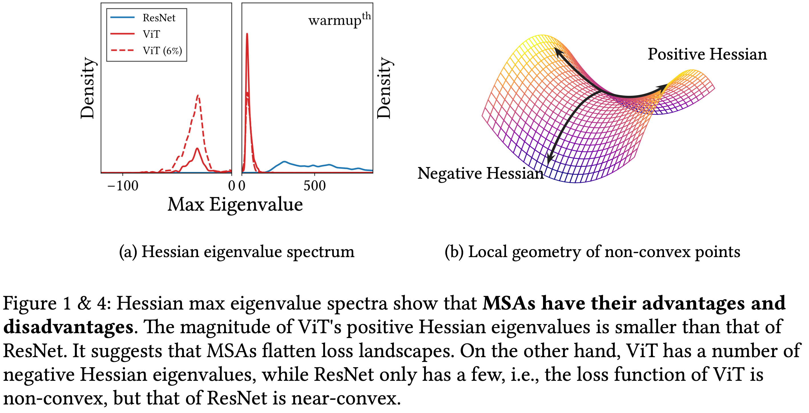
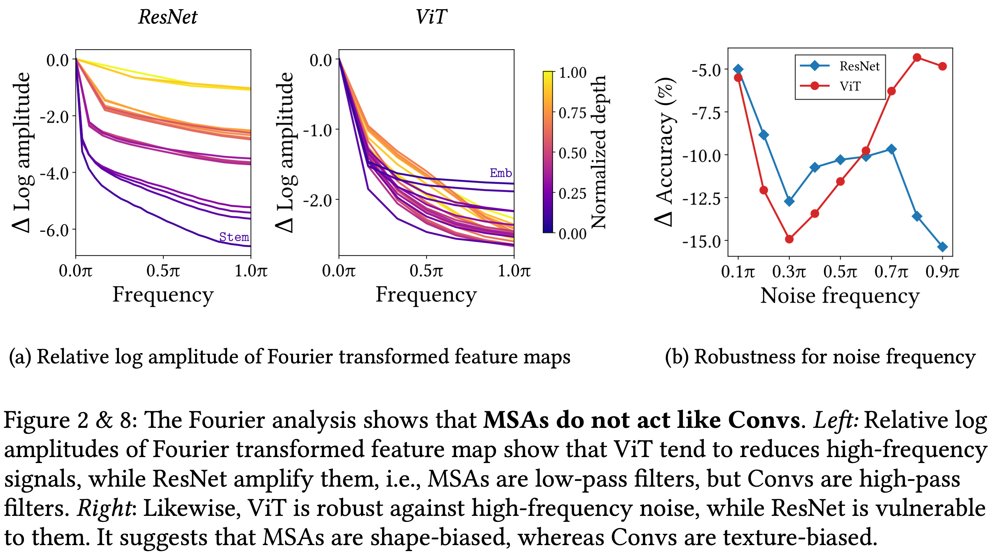
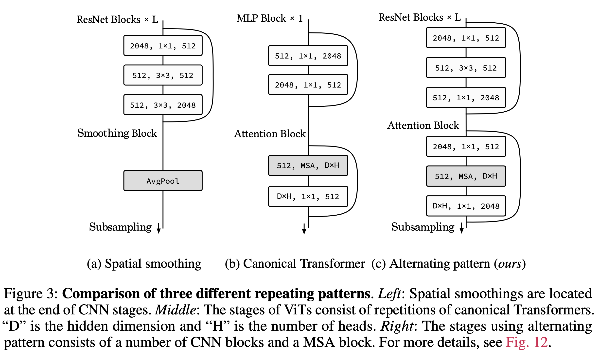
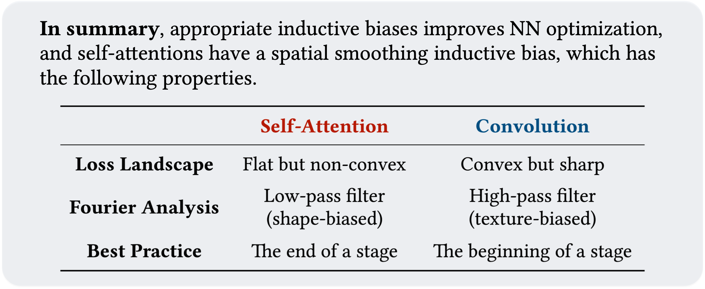

# How Do Vision Transformers Work?

[[arxiv](https://arxiv.org/abs/2202.06709), [poster](https://github.com/xxxnell/how-do-vits-work-storage/blob/master/resources/how_do_vits_work_poster_iclr2022.pdf), [slides](https://github.com/xxxnell/how-do-vits-work-storage/blob/master/resources/how_do_vits_work_talk.pdf)]

This repository provides a PyTorch implementation of ["How Do Vision Transformers Work? (ICLR 2022 Spotlight)"](https://arxiv.org/abs/2202.06709) In the paper, we show that the success of multi-head self-attentions (MSAs) for computer vision ***does NOT lie in their weak inductive bias and the capturing of long-range dependencies***. MSAs are not merely generalized Convs, but rather generalized spatial smoothings that *complement* Convs.
In particular, we address the following three key questions of MSAs and Vision Transformers (ViTs): 

***Q1. What properties of MSAs do we need to better optimize NNs?***  

A1. MSAs have their pros and cons. MSAs improve NNs by flattening the loss landscapes. A key feature is their data specificity (data dependency), not long-range dependency. On the other hand, ViTs suffers from non-convex losses.


***Q2. Do MSAs act like Convs?***  

A2. MSAs and Convs exhibit opposite behaviors—e.g., MSAs are low-pass filters, but Convs are high-pass filters. It suggests that MSAs are shape-biased, whereas Convs are texture-biased. Therefore, MSAs and Convs are complementary.


***Q3. How can we harmonize MSAs with Convs?***  

A3. MSAs at the end of a stage (not a model) significantly improve the accuracy. Based on this, we introduce *AlterNet* by replacing Convs at the end of a stage with MSAs. AlterNet outperforms CNNs not only in large data regimes but also in small data regimes.


👇 Let's find the detailed answers below!


### I. What Properties of MSAs Do We Need to Improve Optimization?

<p align="center">

</p>

MSAs improve not only accuracy but also generalization by flattening the loss landscapes (reducing the magnitude of Hessian eigenvalues). ***Such improvement is primarily attributable to their data specificity, NOT long-range dependency*** 😱 On the other hand, ViTs suffers from non-convex losses (negative Hessian eigenvalues). Their weak inductive bias and long-range dependency produce negative Hessian eigenvalues in small data regimes, and these non-convex points disrupt NN training. Large datasets and loss landscape smoothing methods alleviate this problem.


### II. Do MSAs Act Like Convs?

<p align="center">

</p>

MSAs and Convs exhibit opposite behaviors. Therefore, MSAs and Convs are complementary. For example, MSAs are low-pass filters, but Convs are high-pass filters. Likewise, Convs are vulnerable to high-frequency noise but that MSAs are vulnerable to low-frequency noise: it suggests that MSAs are shape-biased, whereas Convs are texture-biased. In addition, Convs transform feature maps and MSAs aggregate transformed feature map predictions. Thus, it is effective to place MSAs after Convs.


### III. How Can We Harmonize MSAs With Convs?

<p align="center">

</p>

Multi-stage neural networks behave like a series connection of small individual models. In addition, MSAs at the end of a stage (not the end of a model) play a key role in prediction. Considering these insights, we propose design rules to harmonize MSAs with Convs. NN stages using this design pattern consists of a number of CNN blocks and one (or a few) MSA block. The design pattern naturally derives the structure of the canonical Transformer, which has one MLP block for one MSA block.

Based on these design rules, we introduce AlterNet ([code](https://github.com/xxxnell/how-do-vits-work/blob/transformer/models/alternet.py)) by replacing Conv blocks at the end of a stage with MSA blocks. ***Surprisingly, AlterNet outperforms CNNs not only in large data regimes but also in small data regimes***, e.g., CIFAR. This contrasts with canonical ViTs, models that perform poorly on small amounts of data. For more details, see below (["How to Apply MSA to Your Own Model"](#how-to-apply-msa-to-your-own-model) section).

<p align="center">

</p>

But why do Vision Transformers work that way? Our recent paper, ["Blurs Behaves Like Ensembles: Spatial Smoothings to Improve Accuracy, Uncertainty, and Robustness (ICML 2022)"](https://arxiv.org/abs/2105.12639) ([code and summary](https://github.com/xxxnell/spatial-smoothing) :octocat:, [poster](https://github.com/xxxnell/spatial-smoothing-storage/blob/master/resources/blurs_behave_like_ensembles_poster_icml2022.pdf)), shows that even a simple (non-trainable) 2 ✕ 2 box blur filter has the same properties. Spatial smoothings improve accuracy, uncertainty, and robustness simultaneously by *ensembling* spatially nearby feature maps of CNNs and flattening loss landscapes, and self-attentions can be deemed as trainable importance-weighted ensembles of feature maps. In conclusion, MSA is not simply generalized Conv, but rather a generalized (trainable) blur filter that complements Conv. Please check it out!


## Getting Started 

The following packages are required:

* pytorch
* matplotlib
* notebook
* ipywidgets
* timm
* einops
* tensorboard
* seaborn (optional)

We mainly use docker images `pytorch/pytorch:1.9.0-cuda11.1-cudnn8-runtime` for the code. 

See [```classification.ipynb```](classification.ipynb) ([Colab notebook](https://colab.research.google.com/github/xxxnell/how-do-vits-work/blob/transformer/classification.ipynb)) for image classification. Run all cells to train and test models on CIFAR-10, CIFAR-100, and ImageNet. 

**Metrics.** We provide several metrics for measuring accuracy and uncertainty: Acuracy (Acc, ↑) and Acc for 90% certain results (Acc-90, ↑), negative log-likelihood (NLL, ↓), Expected Calibration Error (ECE, ↓), Intersection-over-Union (IoU, ↑) and IoU for certain results (IoU-90, ↑), Unconfidence (Unc-90, ↑), and Frequency for certain results (Freq-90, ↑). We also define a method to plot a reliability diagram for visualization.

**Models.** We provide AlexNet, VGG, pre-activation VGG, ResNet, pre-activation ResNet, ResNeXt, WideResNet, ViT, PiT, Swin, MLP-Mixer, and Alter-ResNet by default. timm implementations also can be used.


<details>
<summary>
  Pretrained models for CIFAR-100 are also provided: <a href="https://github.com/xxxnell/how-do-vits-work-storage/releases/download/v0.1/resnet_50_cifar100_691cc9a9e4.pth.tar">ResNet-50</a>, <a href="https://github.com/xxxnell/how-do-vits-work-storage/releases/download/v0.1/vit_ti_cifar100_9857b21357.pth.tar">ViT-Ti</a>, <a href="https://github.com/xxxnell/how-do-vits-work-storage/releases/download/v0.1/pit_ti_cifar100_0645889efb.pth.tar">PiT-Ti</a>, and <a href="https://github.com/xxxnell/how-do-vits-work-storage/releases/download/v0.1/swin_ti_cifar100_ec2894492b.pth.tar">Swin-Ti</a>. We recommend using <a href="https://github.com/rwightman/pytorch-image-models">timm</a> for ImageNet-1K for the sake of simplicity (e.g., please refer to <code><a href="https://github.com/xxxnell/how-do-vits-work/blob/transformer/fourier_analysis.ipynb">fourier_analysis.ipynb</a></code>).
  </summary>
<br/>
The codes below are snippets for (a) loading pretrained models and (b) converting them into block sequences.
  <br/>

```python
# ResNet-50
import models
  
# a. download and load a pretrained model for CIFAR-100
url = "https://github.com/xxxnell/how-do-vits-work-storage/releases/download/v0.1/resnet_50_cifar100_691cc9a9e4.pth.tar"
path = "checkpoints/resnet_50_cifar100_691cc9a9e4.pth.tar"
models.download(url=url, path=path)

name = "resnet_50"
model = models.get_model(name, num_classes=100,  # timm does not provide a ResNet for CIFAR
                         stem=model_args.get("stem", False))
map_location = "cuda" if torch.cuda.is_available() else "cpu"
checkpoint = torch.load(path, map_location=map_location)
model.load_state_dict(checkpoint["state_dict"])

# b. model → blocks. `blocks` is a sequence of blocks
blocks = [
    model.layer0,
    *model.layer1,
    *model.layer2,
    *model.layer3,
    *model.layer4,
    model.classifier,
]
```

```python
# ViT-Ti
import copy
import timm
import torch
import torch.nn as nn
import models

# a. download and load a pretrained model for CIFAR-100
url = "https://github.com/xxxnell/how-do-vits-work-storage/releases/download/v0.1/vit_ti_cifar100_9857b21357.pth.tar"
path = "checkpoints/vit_ti_cifar100_9857b21357.pth.tar"
models.download(url=url, path=path)

model = timm.models.vision_transformer.VisionTransformer(
    num_classes=100, img_size=32, patch_size=2,  # for CIFAR
    embed_dim=192, depth=12, num_heads=3, qkv_bias=False,  # for ViT-Ti 
)
model.name = "vit_ti"
models.stats(model)
map_location = "cuda" if torch.cuda.is_available() else "cpu"
checkpoint = torch.load(path, map_location=map_location)
model.load_state_dict(checkpoint["state_dict"])


# b. model → blocks. `blocks` is a sequence of blocks

class PatchEmbed(nn.Module):
    def __init__(self, model):
        super().__init__()
        self.model = copy.deepcopy(model)
        
    def forward(self, x, **kwargs):
        x = self.model.patch_embed(x)
        cls_token = self.model.cls_token.expand(x.shape[0], -1, -1)
        x = torch.cat((cls_token, x), dim=1)
        x = self.model.pos_drop(x + self.model.pos_embed)
        return x


class Residual(nn.Module):
    def __init__(self, *fn):
        super().__init__()
        self.fn = nn.Sequential(*fn)
        
    def forward(self, x, **kwargs):
        return self.fn(x, **kwargs) + x
    
    
class Lambda(nn.Module):
    def __init__(self, fn):
        super().__init__()
        self.fn = fn
        
    def forward(self, x):
        return self.fn(x)


def flatten(xs_list):
    return [x for xs in xs_list for x in xs]


# model → blocks. `blocks` is a sequence of blocks
blocks = [
    PatchEmbed(model),
    *flatten([[Residual(b.norm1, b.attn), Residual(b.norm2, b.mlp)] 
              for b in model.blocks]),
    nn.Sequential(model.norm, Lambda(lambda x: x[:, 0]), model.head),
]
```

  
```python
# PiT-Ti
import copy
import math
import timm

import torch
import torch.nn as nn

# a. download and load a pretrained model for CIFAR-100
url = "https://github.com/xxxnell/how-do-vits-work-storage/releases/download/v0.1/pit_ti_cifar100_0645889efb.pth.tar"
path = "checkpoints/pit_ti_cifar100_0645889efb.pth.tar"
models.download(url=url, path=path)

model = timm.models.pit.PoolingVisionTransformer(
    num_classes=100, img_size=32, patch_size=2, stride=1,  # for CIFAR-100
    base_dims=[32, 32, 32], depth=[2, 6, 4], heads=[2, 4, 8], mlp_ratio=4,  # for PiT-Ti
)
model.name = "pit_ti"
models.stats(model)
map_location = "cuda" if torch.cuda.is_available() else "cpu"
checkpoint = torch.load(path, map_location=map_location)
model.load_state_dict(checkpoint["state_dict"])


# b. model → blocks. `blocks` is a sequence of blocks

class PatchEmbed(nn.Module):
    def __init__(self, model):
        super().__init__()
        self.model = copy.deepcopy(model)
        
    def forward(self, x, **kwargs):
        x = self.model.patch_embed(x)
        x = self.model.pos_drop(x + self.model.pos_embed)
        cls_tokens = self.model.cls_token.expand(x.shape[0], -1, -1)

        return (x, cls_tokens)

    
class Concat(nn.Module):
    def __init__(self, model):
        super().__init__()
        self.model = copy.deepcopy(model)
        
    def forward(self, x, **kwargs):
        x, cls_tokens = x
        B, C, H, W = x.shape
        token_length = cls_tokens.shape[1]

        x = x.flatten(2).transpose(1, 2)
        x = torch.cat((cls_tokens, x), dim=1)

        return x
    
    
class Pool(nn.Module):
    def __init__(self, block, token_length):
        super().__init__()
        self.block = copy.deepcopy(block)
        self.token_length = token_length
        
    def forward(self, x, **kwargs):
        cls_tokens = x[:, :self.token_length]
        x = x[:, self.token_length:]
        B, N, C = x.shape
        H, W = int(math.sqrt(N)), int(math.sqrt(N))
        x = x.transpose(1, 2).reshape(B, C, H, W)

        x, cls_tokens = self.block(x, cls_tokens)
        
        return x, cls_tokens
    
    
class Classifier(nn.Module):
    def __init__(self, norm, head):
        super().__init__()
        self.head = copy.deepcopy(head)
        self.norm = copy.deepcopy(norm)
        
    def forward(self, x, **kwargs):
        x = x[:,0]
        x = self.norm(x)
        x = self.head(x)
        return x

    
class Residual(nn.Module):
    def __init__(self, *fn):
        super().__init__()
        self.fn = nn.Sequential(*fn)
        
    def forward(self, x, **kwargs):
        return self.fn(x, **kwargs) + x

    
def flatten(xs_list):
    return [x for xs in xs_list for x in xs]


blocks = [
    nn.Sequential(PatchEmbed(model), Concat(model),),
    *flatten([[Residual(b.norm1, b.attn), Residual(b.norm2, b.mlp)] 
              for b in model.transformers[0].blocks]),
    nn.Sequential(Pool(model.transformers[0].pool, 1), Concat(model),),
    *flatten([[Residual(b.norm1, b.attn), Residual(b.norm2, b.mlp)] 
              for b in model.transformers[1].blocks]),
    nn.Sequential(Pool(model.transformers[1].pool, 1), Concat(model),),
    *flatten([[Residual(b.norm1, b.attn), Residual(b.norm2, b.mlp)] 
              for b in model.transformers[2].blocks]),
    Classifier(model.norm, model.head),
]
```


```python
# Swin-Ti
import copy
import timm
import models

import torch
import torch.nn as nn

# a. download and load a pretrained model for CIFAR-100
url = "https://github.com/xxxnell/how-do-vits-work-storage/releases/download/v0.1/swin_ti_cifar100_ec2894492b.pth.tar"
path = "checkpoints/swin_ti_cifar100_ec2894492b.pth.tar"
models.download(url=url, path=path)

model = timm.models.swin_transformer.SwinTransformer(
    num_classes=100, img_size=32, patch_size=1, window_size=4,  # for CIFAR-100
    embed_dim=96, depths=(2, 2, 6, 2), num_heads=(3, 6, 12, 24), qkv_bias=False,  # for Swin-Ti
)
model.name = "swin_ti"
models.stats(model)
map_location = "cuda" if torch.cuda.is_available() else "cpu"
checkpoint = torch.load(path, map_location=map_location)
model.load_state_dict(checkpoint["state_dict"])


# b. model → blocks. `blocks` is a sequence of blocks

class Attn(nn.Module):
    def __init__(self, block):
        super().__init__()
        self.block = copy.deepcopy(block)
        self.block.mlp = nn.Identity()
        self.block.norm2 = nn.Identity()
        
    def forward(self, x, **kwargs):
        x = self.block(x)
        x = x / 2
        
        return x

class MLP(nn.Module):
    def __init__(self, block):
        super().__init__()
        block = copy.deepcopy(block)
        self.mlp = block.mlp
        self.norm2 = block.norm2
        
    def forward(self, x, **kwargs):
        x = x + self.mlp(self.norm2(x))

        return x

    
class Classifier(nn.Module):
    def __init__(self, norm, head):
        super().__init__()
        self.norm = copy.deepcopy(norm)
        self.head = copy.deepcopy(head)
        
    def forward(self, x, **kwargs):
        x = self.norm(x)
        x = x.mean(dim=1)
        x = self.head(x)

        return x

    
def flatten(xs_list):
    return [x for xs in xs_list for x in xs]


blocks = [
    model.patch_embed,
    *flatten([[Attn(block), MLP(block)] for block in model.layers[0].blocks]),
    model.layers[0].downsample,
    *flatten([[Attn(block), MLP(block)] for block in model.layers[1].blocks]),
    model.layers[1].downsample,
    *flatten([[Attn(block), MLP(block)] for block in model.layers[2].blocks]),
    model.layers[2].downsample,
    *flatten([[Attn(block), MLP(block)] for block in model.layers[3].blocks]),
    Classifier(model.norm, model.head)
]
```
</details>


## Fourier Analysis of Representations 

Refer to [```fourier_analysis.ipynb```](fourier_analysis.ipynb) ([Colab notebook](https://colab.research.google.com/github/xxxnell/how-do-vits-work/blob/transformer/fourier_analysis.ipynb)) to analyze feature maps through the lens of Fourier transform. Run all cells to visualize Fourier transformed feature maps. Fourier analysis shows that MSAs reduce high-frequency signals, while Convs amplified high-frequency components.


## Measuring Feature Map Variances

Refer to [```featuremap_variance.ipynb```](featuremap_variance.ipynb) ([Colab notebook](https://colab.research.google.com/github/xxxnell/how-do-vits-work/blob/transformer/featuremap_variance.ipynb)) to measure feature map variance. Run all cells to visualize feature map variances. Feature map variance shows that MSAs aggregate feature maps, but Convs and MLPs diversify them.


## Visualizing the Loss Landscapes

Refer to [```losslandscape.ipynb```](losslandscape.ipynb) ([Colab notebook](https://colab.research.google.com/github/xxxnell/how-do-vits-work/blob/transformer/losslandscape.ipynb)) or [the original repo](https://github.com/tomgoldstein/loss-landscape) for exploring the loss landscapes. Run all cells to get predictive performance of the model for weight space grid. Loss landscape visualization shows that ViT has a flatter loss than ResNet.


## Evaluating Robustness on Corrupted Datasets

Refer to [```robustness.ipynb```](robustness.ipynb) ([Colab notebook](https://colab.research.google.com/github/xxxnell/how-do-vits-work/blob/transformer/robustness.ipynb)) for evaluation corruption robustness on [corrupted datasets](https://github.com/hendrycks/robustness) such as CIFAR-10-C and CIFAR-100-C. Run all cells to get predictive performance of the model on datasets which consist of data corrupted by 15 different types with 5 levels of intensity each. 


## How to Apply MSA to Your Own Model

<p align="center">

</p>

We find that MSA complements Conv (not replaces Conv), and *MSA closer to the end of a stage* improves predictive performance significantly. Based on these insights, we propose the following build-up rules:

1. Alternately replace Conv blocks with MSA blocks from the end of a baseline CNN model. 
2. If the added MSA block does not improve predictive performance, replace a Conv block located at the end of an earlier stage with an MSA. 
3. Use more heads and higher hidden dimensions for MSA blocks in late stages.

In the animation above, we replace Convs of ResNet with MSAs one by one according to the build-up rules. Note that several MSAs in `c3` harm the accuracy, but the MSA at the end of `c2` improves it. As a result, surprisingly, the model with MSAs following the appropriate build-up rule outperforms CNNs even in the small data regimes, e.g., CIFAR-100!


## Investigate Loss Landscapes and Hessians With L2 Regularization on Augmented Datasets

Two common mistakes are investigating loss landscapes and Hessians (1) *'without considering L2 regularization'* on (2) *'clean datasets'*. However, note that NNs are optimized with L2 regularization on augmented datasets. Therefore, it is appropriate to visualize *'NLL + L2'* on *'augmented datasets'*. Measuring criteria without L2 on clean datasets would give incorrect results.


## Citation

If you find this useful, please consider citing 📑 the paper and starring 🌟 this repository. Please do not hesitate to contact Namuk Park (email: namuk.park at gmail dot com, twitter: [xxxnell](https://twitter.com/xxxnell)) with any comments or feedback.

```
@inproceedings{park2022how,
  title={How Do Vision Transformers Work?},
  author={Namuk Park and Songkuk Kim},
  booktitle={International Conference on Learning Representations},
  year={2022}
}
```


## License

All code is available to you under Apache License 2.0. CNN models build off the torchvision models which are BSD licensed. ViTs build off the [PyTorch Image Models](https://github.com/rwightman/pytorch-image-models) and [Vision Transformer - Pytorch](https://github.com/lucidrains/vit-pytorch) which are Apache 2.0 and MIT licensed.

Copyright the maintainers.


