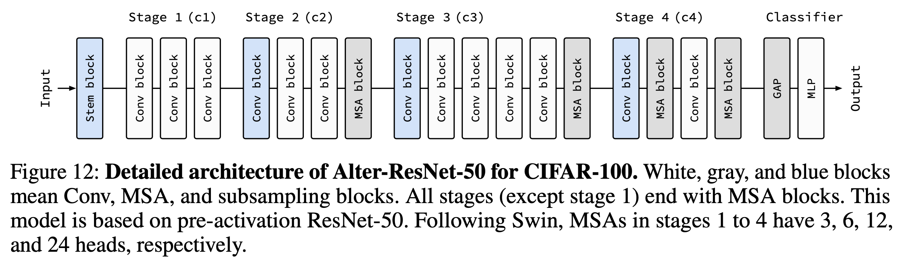

# How Do Vision Transformers Work?

This repository provides a PyTorch implementation of "How Do Vision Transformers Work?" In the paper, we show that (1) MSAs flatten the loss landscapes, (2) MSAs are low-pass filters as opposed to convolutions (Convs), and (3) MSAs at the end of a stage significantly improve the accuracy.

In particular, we address the following three key questions of multi-head self-attentions (MSAs) and Vision Transformers (ViTs): 
1. What properties of MSAs do we need to better optimize NNs? Do the long-range dependencies of MSAs help NNs learn?
2. Do MSAs act like Convs? If not, how are they different?
3. How can we harmonize MSAs with Convs? Can we just leverage their advantages?

<br />
<br />


**What properties of MSAs do we need to improve optimization?** MSAs improve not only accuracy but also generalization by flattening the loss landscapes. *Such improvement is primarily attributable to their data specificity, not long-range dependency*. Their weak inductive bias disrupts NN training. On the other hand, ViTs suffers from non-convex losses. MSAs allow negative Hessian eigenvalues in small data regimes. Large datasets and loss landscape smoothing methods alleviate this problem.


<br />
<br />


**Do MSAs act like Convs?** MSAs and Convs exhibit opposite behaviors. For example, MSAs are low-pass filters, but Convs are high-pass filters. In addition, Convs are vulnerable to high-frequency noise but that MSAs are not. Therefore, MSAs and Convs are complementary.

<br />
<br />


**How can we harmonize MSAs with Convs?** Multi-stage neural networks behave like a series connection of small individual models. In addition, MSAs at the end of a stage play a key role in prediction. Based on these insights, we propose design rules to harmonize MSAs with Convs. NN stages using this design pattern consists of a number of CNN blocks and one (or a few) MSA block. The design pattern naturally derives the structure of canonical Transformer, which has one MLP block for one MSA block.

<br />



In addition, we also introduce AlterNet, a model in which Conv blocks at the end of a stage are replaced with MSA blocks. Surprisingly, AlterNet outperforms CNNs not only in large data regimes but also in small data regimes. This contrasts with canonical ViTs, a model that performs poorly on small amounts of data.


This repository is based on [the official implementation of "Blurs Make Results Clearer: Spatial Smoothings to Improve Accuracy, Uncertainty, and Robustness"](https://github.com/xxxnell/spatial-smoothing).  In this paper, we show that a simple (non-trainable) 2✕2 box blur filter improves accuracy, uncertainty, and robustness simultaneously by ensembling spatially nearby feature maps of CNNs. MSA is not simply generalized Conv, but rather a generalized (trainable) blur filter that complements Conv. Please check it out!


## Getting Started 

The following packages are required:

* pytorch==1.6.0
* matplotlib==3.1.1
* notebook==5.7.10
* ipywidgets==7.5.1 
* tensorboard
* timm (optional)
* seaborn (optional)

We mainly use docker images `pytorch/pytorch:1.9.0-cuda11.1-cudnn8-runtime` for the code. 

See ```classification.ipynb``` for image classification. Run all cells to train and test models on CIFAR-10, CIFAR-100, and ImageNet. 

**Metrics.** We provide several metrics for measuring accuracy and uncertainty: Acuracy (Acc, ↑) and Acc for 90% certain results (Acc-90, ↑), negative log-likelihood (NLL, ↓), Expected Calibration Error (ECE, ↓), Intersection-over-Union (IoU, ↑) and IoU for certain results (IoU-90, ↑), Unconfidence (Unc-90, ↑), and Frequency for certain results (Freq-90, ↑). We also define a method to plot a reliability diagram for visualization.

**Models.** We provide AlexNet, VGG, pre-activation VGG, ResNet, pre-activation ResNet, ResNeXt, WideResNet, ViT, PiT, Swin, Mixer, and Alter-ResNet by default.


## Visualizing the Loss Landscapes

Refer to ```losslandscape.ipynb``` for exploring the loss landscapes. It requires a trained model. Run all cells to get predictive performance of the model for weight space grid. We provide [a sample loss landscape result](resources/results/cifar100_resnet_mcdo_18_x10_losslandscape.csv).


## Evaluating Robustness on Corrupted Datasets

Refer to ```robustness.ipynb``` for evaluation corruption robustness on [corrupted datasets](https://github.com/hendrycks/robustness) such as CIFAR-10-C and CIFAR-100-C. It requires a trained model. Run all cells to get predictive performance of the model on datasets which consist of data corrupted by 15 different types with 5 levels of intensity each. We provide [a sample robustness result](resources/results/imagenet_alexnet_dnn_corrupted.csv).


## How to Apply MSA to Your Own Model

We find that MSA complements Conv (not replaces Conv), and *MSA closer to the end of stage* improves predictive performance significantly. Based on these insights, we propose the following design rules:

1. Alternately replace Conv blocks with MSA blocks from the end of a baseline CNN model. 
2. If the MSA block does not improve predictive performance sufficiently, replace a Conv block with a MSA block at the end of an earlier stage.
3. Use more heads and higher hidden dimensions for MSA blocks in late stages.

Surprisingly, the model with MSAs following the appropriate building-up rule outperforms CNNs even in the small data regime, e.g., CIFAR!


## Citation

If you find this useful, please consider citing 📑 the paper and starring 🌟 this repository. Please do not hesitate to contact Namuk Park (email: namuk.park at gmail dot com, twitter: [xxxnell](https://twitter.com/xxxnell)) with any comments or feedback.

BibTex is TBD.


## License

All code is available to you under Apache License 2.0. CNN models build off the torchvision models which are BSD licensed. ViTs build off the [PyTorch Image Models](https://github.com/rwightman/pytorch-image-models) and [Vision Transformer - Pytorch](https://github.com/lucidrains/vit-pytorch) which are Apache 2.0 and MIT licensed.

Copyright the maintainers.


